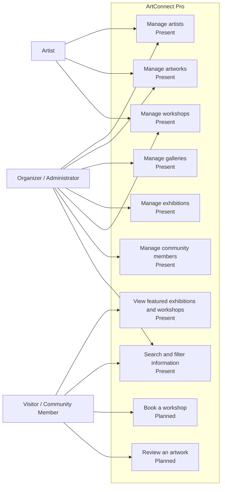
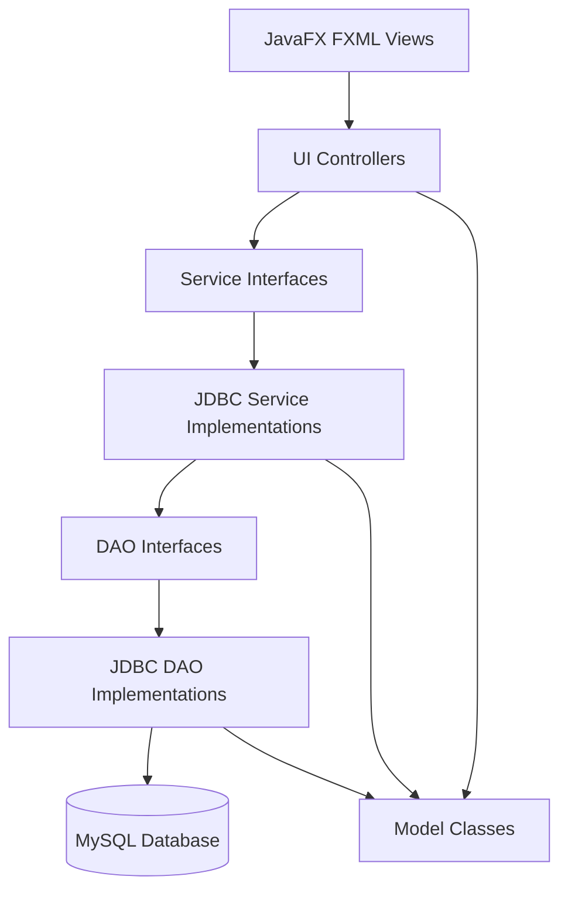
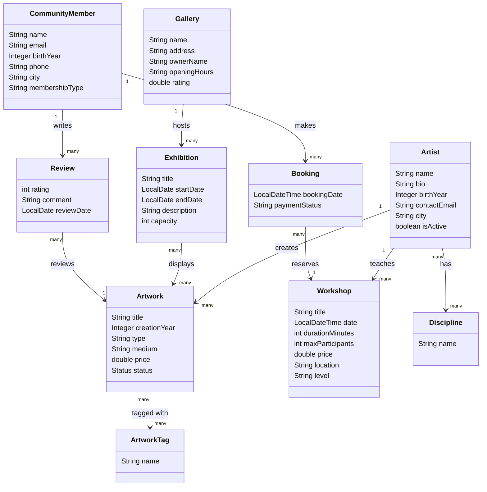
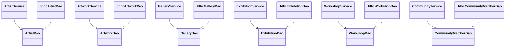

# ArtConnect Pro Report

## Step 1: Understanding ArtConnect and Defining the Functional Scope

### Objective

The objective of this first step is to understand the provided ArtConnect Pro application, identify its main screens and features, define the target users, and describe the functional scope that will be supported by the database.

ArtConnect Pro is a JavaFX desktop application for managing a local art community. It helps organize information about artists, artworks, galleries, exhibitions, workshops, and community members.

---

## 1. Exploring the Provided Application

### Application Type

ArtConnect Pro is a Java application built with JavaFX. It uses a layered architecture:

- User interface layer: JavaFX screens and controllers
- Service layer: business operations
- DAO layer: data access interfaces
- Persistence layer: JDBC implementations
- Model layer: application entities

The original project skeleton was designed to run first with dummy data. In the current version, the service provider is connected to JDBC services, so the application is prepared to work with a MySQL database.

### Main Screens

The application contains the following main tabs:

| Screen | Purpose |
|---|---|
| Discover | Shows featured exhibitions and upcoming workshops |
| Artists | Manages artists and their information |
| Artworks | Manages artworks created by artists |
| Galleries | Manages galleries and their details |
| Exhibitions | Manages exhibitions hosted in galleries |
| Workshops | Manages workshops taught by artists |
| Community | Manages community members |

---

## 2. Functional Analysis

### Main Features Seen in the Interface

From the user's point of view, the application allows:

- Viewing featured exhibitions and workshops.
- Searching in the Discover page.
- Adding, updating, deleting, and searching artists.
- Filtering artists by discipline.
- Adding, updating, deleting, and searching artworks.
- Linking an artwork to an artist.
- Adding, updating, deleting, and searching galleries.
- Adding, updating, deleting, and searching exhibitions.
- Linking an exhibition to a gallery.
- Adding, updating, deleting, and searching workshops.
- Linking a workshop to an artist instructor.
- Adding, updating, deleting, and searching community members.
- Managing simple membership types such as BASIC and PREMIUM.

### User Roles

The application does not currently include authentication, but we can define simple roles conceptually.

| Role | Description |
|---|---|
| Organizer / Administrator | Manages artists, artworks, galleries, exhibitions, workshops, and members |
| Visitor / Community Member | Views exhibitions and workshops, and can be registered as a community member |
| Artist | Has a profile, creates artworks, and may teach workshops |

### Functional Scope for the Database

The database should store the main data used by the application:

- Artists
- Artworks
- Galleries
- Exhibitions
- Workshops
- Community members
- Bookings for workshops
- Reviews for artworks
- Disciplines and artwork tags

Some features are already visible in the interface, while others are planned because they exist in the model but are not fully available as screens.

### Feature Legend

| Symbol | Meaning |
|---|---|
| Present | Already available in the interface |
| Planned | Useful future feature or partially represented in the model |

### Use Case Diagram

---

## 3. Static Design

### General Architecture

The project follows a layered structure. The user interacts with JavaFX screens. Controllers call services. Services use DAO interfaces. JDBC DAO classes communicate with the database.

### Main Model Class Diagram

### Service and DAO Structure

---

## Deliverable for Step 1

This section provides:

- A simple description of the application.
- The list of main screens.
- The list of main features.
- The main user roles.
- A use case diagram.
- A simple architecture diagram.
- Class diagrams for the model and persistence structure.
